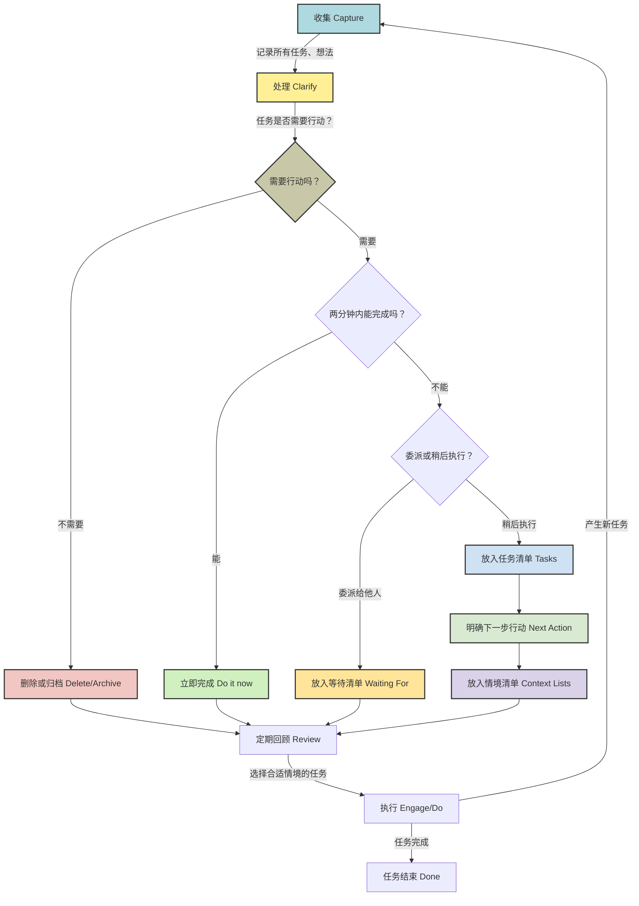

---
tags:
  - GTD
  - TaskManagement
Date-creation: 2025-04-07
---
## Concept & Core Principal
---
- GTD, **全称为 Getting Things Done**
- 核心理念：**大脑更擅长思考和创新，而非记忆和管理所有需要完成的事项**
- GTD基于以下几个模块实现其有效性
![[GTD.excalidraw]]
- **Trusted System**: 一个可信赖的外部系统，必须**必须能够可靠地记录和提醒用户所有事项**
> [!tips] 这种信任感的建立需要用户持续地维护和使用该系统。因此建议从简到难
- **Appropriate Engagement**: 简单任务立即完成，复杂任务分解步骤
- **Close the Open Loops**: 事项处理闭环！==**人的大脑天生会记住那些未完成的事务，这些“开放循环”会持续消耗用户的心理能量，导致压力和焦虑**==
> [!tips] **这种清空大脑的过程是 GTD 减轻压力的关键机制之一**
- **Bottom-Up Approach**: ==自下而上，先有效管理/控制日常生活的基础事务，再进一步思考更高层次的愿景==
> Mind like Water

## Pros
---
- 消除犹豫不决的情况
	- 工作流设计时使用简单的判断规则处理每个需要完成的工作任务
- **GTD 提供了一个清晰的行动计划和明确的下一步行动**
	- 减轻面对工作清单的压力
- 通过简单的处理流程**提升对生活的掌控感**
- **定期的回顾是 GTD 工作流程中至关重要的一步**，有助于提高计划性
- 帮助大脑**自由地思考，并产生新的想法和解决方案**

## WorkFlow
---
- GTD工作流图如下

