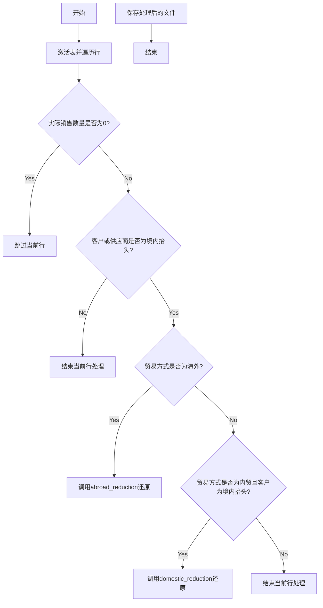
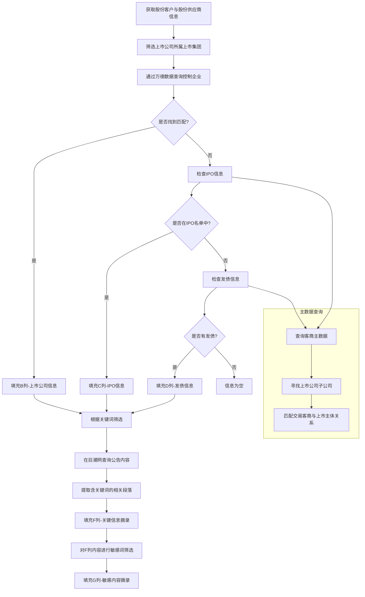

```mermaid
flowchart TD
    A[开始] --> B[激活表并遍历行]
    B --> C{实际销售数量是否为0?}
    C -->|Yes| D[跳过当前行]
    C -->|No| E{客户或供应商是否为境内抬头?}
    E -->|No| F[结束当前行处理]
    E -->|Yes| G{贸易方式是否为海外?}
    G -->|Yes| H[调用abroad_reduction还原]
    G -->|No| I{贸易方式是否为内贸且客户为境内抬头?}
    I -->|Yes| J[调用domestic_reduction还原]
    I -->|No| K[结束当前行处理]
    L[保存处理后的文件] --> M[结束]
```

```mermaid
flowchart TD
    A[获取股份客户与股份供应商信息] --> B[筛选上市公司所属上市集团]
    B --> C[通过万德数据查询控制企业]
    C --> D{是否找到匹配?}
    D -->|是| E[填充B列-上市公司信息]
    D -->|否| F[检查IPO信息]
    F --> G{是否在IPO名单中?}
    G -->|是| H[填充C列-IPO信息]
    G -->|否| I[检查发债信息]
    I --> J{是否有发债?}
    J -->|是| K[填充D列-发债信息]
    J -->|否| L[信息为空]
    
    E --> M[根据关键词筛选]
    H --> M
    K --> M
    M --> N[在巨潮网查询公告内容]
    N --> O[提取含关键词的相关段落]
    O --> P[填充F列-关键信息摘录]
    P --> Q[对F列内容进行敏感词筛选]
    Q --> R[填充G列-敏感内容摘录]
    
    subgraph 主数据查询
    S[查询客商主数据] --> T[寻找上市公司子公司]
    T --> U[匹配交易客商与上市主体关系]
    end
    
    F --> S
    I --> S
```
