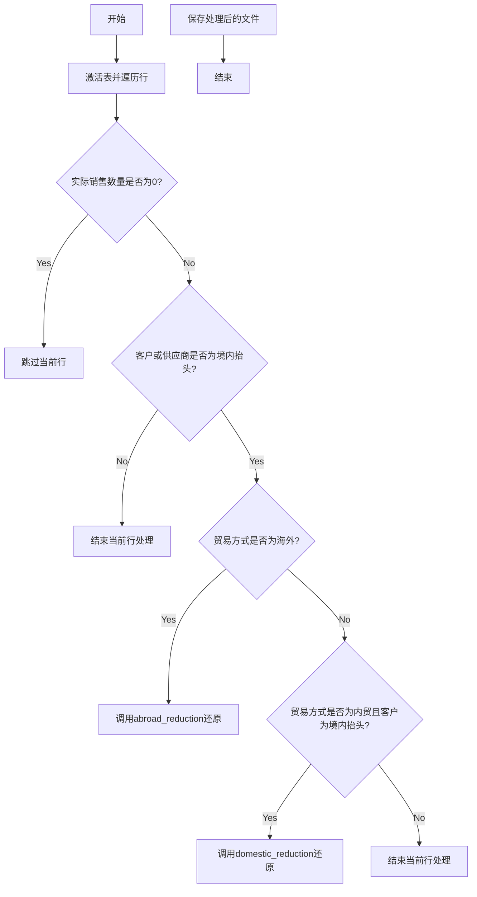

```mermaid
flowchart TD
    A[获取股份客户与股份供应商信息] --> B[筛选上市公司所属上市集团]
    B --> C[通过万德数据查询控制企业]
    C --> D{是否找到匹配?}
    D -->|是| E[填充B列-上市公司信息]
    D -->|否| F[检查IPO信息]
    F --> G{是否在IPO名单中?}
    G -->|是| H[填充C列-IPO信息]
    G -->|否| I[检查发债信息]
    I --> J{是否有发债?}
    J -->|是| K[填充D列-发债信息]
    J -->|否| L[信息为空]
    
    E --> M[根据关键词筛选]
    H --> M
    K --> M
    M --> N[在巨潮网查询公告内容]
    N --> O[提取含关键词的相关段落]
    O --> P[填充F列-关键信息摘录]
    P --> Q[对F列内容进行敏感词筛选]
    Q --> R[填充G列-敏感内容摘录]
    
    subgraph IPO详细逻辑
    F1[检查四张IPO表] --> F2[识别IPO名单中的母公司/集团主体]
    F2 --> F3[通过主数据查询关联子公司]
    F3 --> F4{子公司是否在客商数据中?}
    F4 -->|是| F5[标记为IPO关联客商]
    F4 -->|否| F6[继续检查下一个]
    end
    
    subgraph 发债详细逻辑
    I1[检查发债表中的"发行人"列] --> I2[识别发债主体公司]
    I2 --> I3[通过主数据查询关联子公司]
    I3 --> I4{子公司是否在客商数据中?}
    I4 -->|是| I5[标记为发债关联客商]
    I4 -->|否| I6[继续检查下一个]
    end
    
    F --> F1
    F5 --> H
    F6 --> I
    I --> I1
    I5 --> K
    I6 --> L
    
    subgraph 主数据查询流程
    Z1[通过嘉宝获取完整客商主数据] --> Z2[匹配潜在关联公司与实际交易客商]
    Z2 --> Z3[确认母公司-子公司关系]
    end
    
    F3 --> Z1
    I3 --> Z1
```
