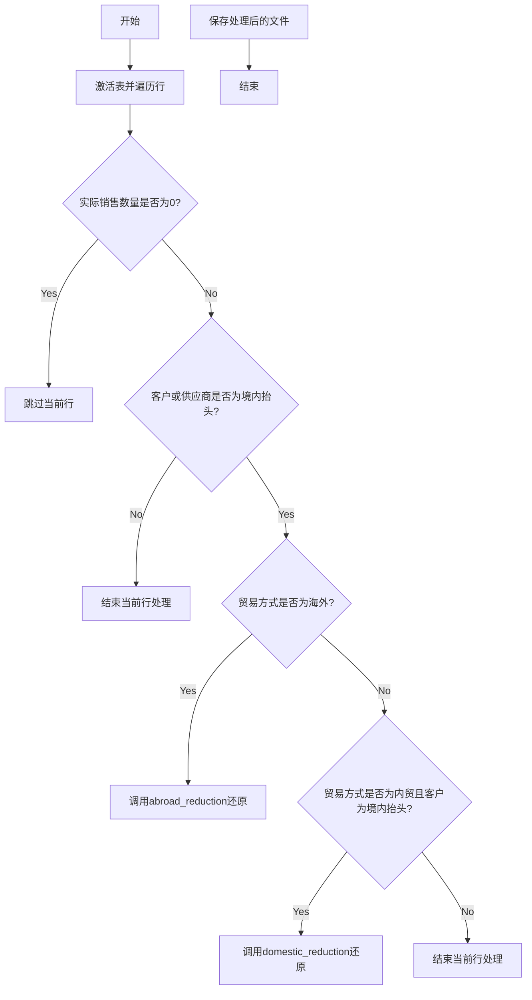
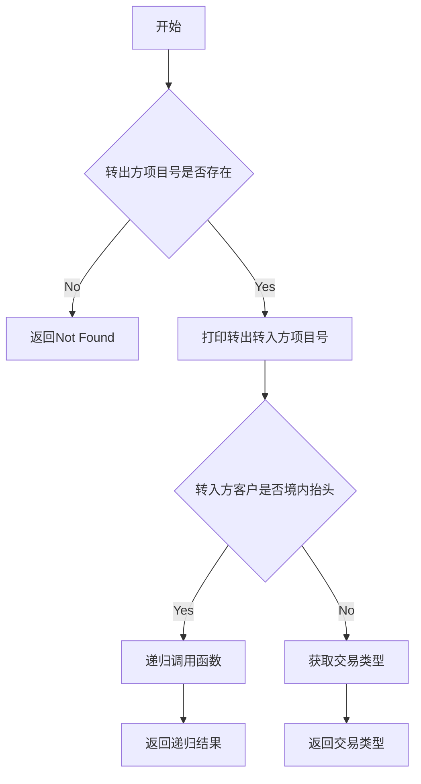

```mermaid
flowchart TD
    A[开始] --> B[激活表并遍历行]
    B --> C{实际销售数量是否为0?}
    C -->|Yes| D[跳过当前行]
    C -->|No| E{客户或供应商是否为境内抬头?}
    E -->|No| F[结束当前行处理]
    E -->|Yes| G{贸易方式是否为海外?}
    G -->|Yes| H[调用abroad_reduction还原]
    G -->|No| I{贸易方式是否为内贸且客户为境内抬头?}
    I -->|Yes| J[调用domestic_reduction还原]
    I -->|No| K[结束当前行处理]
    L[保存处理后的文件] --> M[结束]
```

```mermaid
flowchart TD
    A[开始] --> B{转出方项目号是否存在}
    B -->|No| C[返回Not Found]
    B -->|Yes| D[打印转出转入方项目号]
    D --> E{转入方客户是否境内抬头}
    E -->|Yes| F[递归调用函数]
    F --> G[返回递归结果]
    E -->|No| H[获取交易类型]
    H --> I[返回交易类型]
```
